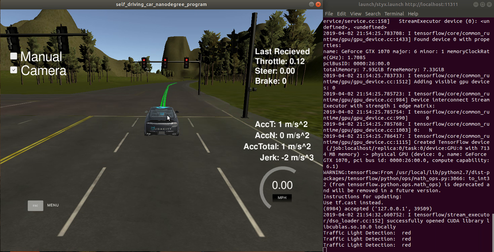
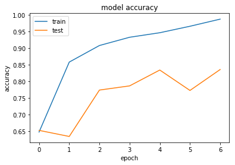
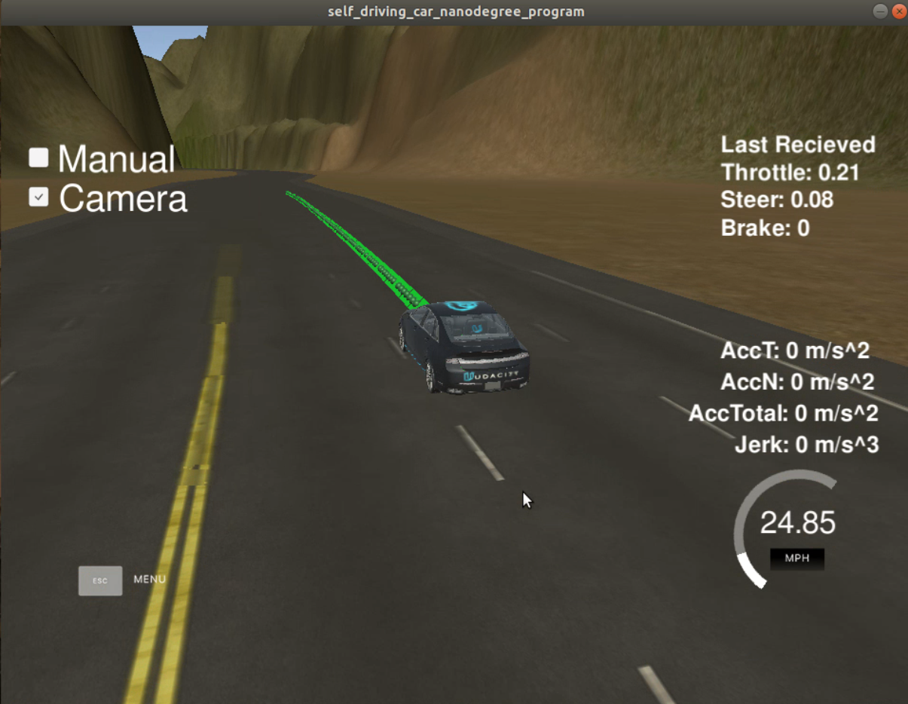

# Capstone Project

## - Programming a Real Self-Driving Car 

Self-Driving Car Engineer Nanodegree Program

##### Author: Pengmian Yan

##### Created on: April 03, 2019


## 1. Project Introduction

This is the final project of the Udacity Self-Driving Car Engineer Nanodegree program. In this project, I designed the most modules and integrate them all together as an autonomous vehicle system in ROS framework to enable our car Carla drive around the test track in Simulator.

Carla will load the base waypoints from the simulator and adapts the desired velocity of waypoints according to the traffic light color detected by camera. Then it will interpret all the information to commands of throttle, braking and steering to realize the lateral and longitudinal control through the Drive-By-Wire module. I implemented the modules/nodes waypoint_updater, twist_controller and  traffic light detector in Python on my own and adapts the waypoint_follower from [Autoware](https://github.com/autowarefoundation/autoware), which is written in C++. I used transfer learning with Keras API to detect the traffic light color. I retrain the VGG16 Model twice on my small simulator dataset and get a fine result. 

FYI: Why calls it capstone project?

Cap stone or capstone is one of the finishing or protective stones that form the top of an exterior masonry wall or building ([Wiki](https://en.wikipedia.org/wiki/Keystone_(architecture))). The Capstone project is a traditionally the final project of a course, where the students get an assessment exam to test their interdisciplinary skills.

## 2. Demo of Result

As a result my path planner passed the [project rubic](https://review.udacity.com/#!/rubrics/1969/view) of Udacity. My code successfully navigate Carla around the test track in simulator without incident, which means it didn't violate any traffic light or ever got off the lane. 

As shown below, on the left is the situation in simulator. The "Manual" is deactivated, as the car should drive autonomously. On the right side we can see the real-time monitoring about the traffic light detection. On the moment of screen-shot, the car stop before the stopline because the traffic light is red. 

[The Whole Video](https://youtu.be/3xbyeSiUUDs)




## 3. Running the Code

### 3.1 Installation

#### 3.1.1 Native Installation

- Be sure that your workstation is running Ubuntu 16.04 Xenial Xerus or Ubuntu 14.04 Trusty Tahir. [Ubuntu downloads can be found here](https://www.ubuntu.com/download/desktop).

- If using a Virtual Machine to install Ubuntu, use the following configuration as minimum:

  - 2 CPU
  - 2 GB system memory
  - 25 GB of free hard drive space

  The Udacity provided virtual machine has ROS and Dataspeed DBW already installed, so you can skip the next two steps if you are using this.

- Follow these instructions to install ROS

  - [ROS Kinetic](http://wiki.ros.org/kinetic/Installation/Ubuntu) if you have Ubuntu 16.04.
  - [ROS Indigo](http://wiki.ros.org/indigo/Installation/Ubuntu) if you have Ubuntu 14.04.

- [Dataspeed DBW](https://bitbucket.org/DataspeedInc/dbw_mkz_ros)

  - Use this option to install the SDK on a workstation that already has ROS installed: [One Line SDK Install (binary)](https://bitbucket.org/DataspeedInc/dbw_mkz_ros/src/81e63fcc335d7b64139d7482017d6a97b405e250/ROS_SETUP.md?fileviewer=file-view-default)

- Download the [Udacity Simulator](https://github.com/udacity/CarND-Capstone/releases).

#### 3.1.2 Docker Installation

[Install Docker](https://docs.docker.com/engine/installation/)

Build the docker container

```bash
docker build . -t capstone
```

Run the docker file

```bash
docker run -p 4567:4567 -v $PWD:/capstone -v /tmp/log:/root/.ros/ --rm -it capstone
```

### 3.2 Port Forwarding

To set up port forwarding, please refer to the [instructions from term 2](https://classroom.udacity.com/nanodegrees/nd013/parts/40f38239-66b6-46ec-ae68-03afd8a601c8/modules/0949fca6-b379-42af-a919-ee50aa304e6a/lessons/f758c44c-5e40-4e01-93b5-1a82aa4e044f/concepts/16cf4a78-4fc7-49e1-8621-3450ca938b77)

### 3.3 Usage

1. Clone the project repository

```bash
git clone https://github.com/udacity/CarND-Capstone.git
```

2. Install python dependencies

```bash
cd CarND-Capstone
pip install -r requirements.txt
```

3. Make and run styx

```bash
cd ros
catkin_make
source devel/setup.sh
roslaunch launch/styx.launch

quicker way:
cd ros
./run.sh
```

4. Run the simulator and deactivate the "Manual" Mode


## 4. Input to the autonomous vehicle system

Here is the data provided from the Simulator to the C++ Program

#### 4.1 /base_waypoint 

The autonomous vehicle system scbsribe to the topic /base_waypoint to get the whole waypoints at one time. 

#### 4.2 /current_pose

The current state (position and velocity etc.) of car will be publish to the topic /current_pose. 

#### 4. 3 /image_color

We also get the image from camera. We can use image_processing in the perception. 

#### 4.5 stop_line_positions

The file "[sim_traffic_light_config.yaml](./ros/src/tl_detector/sim_traffic_light_config.yaml)" provides the position of all stoplines at crossing intersection.


### 5. Implementation of my autonomous vehicle system

#### 5.1 System Architecture

I build my autonomous vehicle system from a usual chain for a self-driving car:

1. Perception
2. Planning
3. Control 

I break these three parts into several submodules. Each submodule is implemented within a node in ROS. All node communicate with each other through publish/subcribe to specific topics. These topic update in different frequencies depending on the need.


#### 5.2 Code Structure

All my codes are in the folder "src". 

The directory structure of this repository is as follows:

root
├── data
│   ├── churchlot_with_cars.csv
│   ├── grasshopper_calibration.yml
│   ├── maptf.launch
│   ├── sim_waypoints.csv
│   ├── wp_yaw_const.csv
│   └── wp_yaw.txt
├── Dockerfile
├── imgs
 |── LICENSE
├── README.md
├── requirements.txt
├── ros
│   ├── build
│   ├── devel
│   ├── launch
│   │   ├── site.launch
│   │   └── styx.launch
│   ├── run.sh
│   └── src
│       ├── camera_info_publisher
│       ├── CMakeLists.txt -> /opt/ros/melodic/share/catkin/cmake/toplevel.cmake
│       ├── styx
│       ├── styx_msgs
│       ├── tl_detector
│       ├── twist_controller
│       ├── waypoint_follower
│       ├── waypoint_loader
│       └── waypoint_updater
└── Udacity_README.md


#### 5.3 Traffic Light Detector

This module was implemented in folder tl_detector. First of all, the node will load the a-prior positions of all traffic light and find the closest one ahead. Then the image of color will be sent to the tl_classifier to predict the color of traffic light as long as the traffic light get into the visual field of camera. The tl_classifier will load the deep learning model (traffic_light_classifier_model.h5) I trained to process the image from camera. 

How I train the model is documented in the Jupyter Notebook [train.ipynb](./ros/src/tl_detector/light_classification/). Because of the small dataset of simulator, I have to use transfer learning. 

|    Samples | Numbers |
| ---------: | :------ |
|      train | 525     |
| validation | 66      |
|       test | 66      |
|      summe | 657     |

I load the [VGG16 model](https://arxiv.org/abs/1409.1556) from Keras with the pretrained ImageNet weights and discarded the last layer. I added a global_average_pooling layer and two dense layer. Hence a new VGG model with 21 layer created.  I freeze the weights of all original 19 layers and only train the weights of new added layer, because of our small dataset again.

```
___
Layer (type)                 Output Shape              Param #   
=================================================================
input_1 (InputLayer)         (None, 600, 800, 3)       0         
_________________________________________________________________
block1_conv1 (Conv2D)        (None, 600, 800, 64)      1792      
_________________________________________________________________
block1_conv2 (Conv2D)        (None, 600, 800, 64)      36928     
_________________________________________________________________
block1_pool (MaxPooling2D)   (None, 300, 400, 64)      0         
_________________________________________________________________
block2_conv1 (Conv2D)        (None, 300, 400, 128)     73856     
_________________________________________________________________
block2_conv2 (Conv2D)        (None, 300, 400, 128)     147584    
_________________________________________________________________
block2_pool (MaxPooling2D)   (None, 150, 200, 128)     0         
_________________________________________________________________
block3_conv1 (Conv2D)        (None, 150, 200, 256)     295168    
_________________________________________________________________
block3_conv2 (Conv2D)        (None, 150, 200, 256)     590080    
_________________________________________________________________
block3_conv3 (Conv2D)        (None, 150, 200, 256)     590080    
_________________________________________________________________
block3_pool (MaxPooling2D)   (None, 75, 100, 256)      0         
_________________________________________________________________
block4_conv1 (Conv2D)        (None, 75, 100, 512)      1180160   
_________________________________________________________________
block4_conv2 (Conv2D)        (None, 75, 100, 512)      2359808   
_________________________________________________________________
block4_conv3 (Conv2D)        (None, 75, 100, 512)      2359808   
_________________________________________________________________
block4_pool (MaxPooling2D)   (None, 37, 50, 512)       0         
_________________________________________________________________
block5_conv1 (Conv2D)        (None, 37, 50, 512)       2359808   
_________________________________________________________________
block5_conv2 (Conv2D)        (None, 37, 50, 512)       2359808   
_________________________________________________________________
block5_conv3 (Conv2D)        (None, 37, 50, 512)       2359808   
_________________________________________________________________
block5_pool (MaxPooling2D)   (None, 18, 25, 512)       0         
_________________________________________________________________
global_average_pooling2d_1 ( (None, 512)               0         
_________________________________________________________________
dense_1 (Dense)              (None, 512)               262656    
_________________________________________________________________
dense_2 (Dense)              (None, 1)                 513       
=================================================================
Total params: 14,977,857
Trainable params: 263,169
Non-trainable params: 14,714,688
```

After 4th epoch, the train accuracy increases further but the test accuracy starts to oscillate. That means the the model is over fitted after 4th epoch. which is quite normal, as the dataset is quite small the learning rate is constant. 



I analyzed the incorrect prediction. They are all very difficult samples: the traffic light is very small and not quite clear because of the big distance to the traffic light. To get a stable prediction I filtered out this super difficult samples from the train samples. With the new dataset I retrain my model on the 4th epoch again, using a learning rate decay. That means the learning rate decrease after each step.  In the end, I get a test accuracy of 94%, which is unexpectedly even higher than the biggest validation accuracy 0.8638. Anyway, the second slower transfer learning works well. 

Then I tested the traffic light detector in the simulator. I found that the detection is a little bite unstable as the car is very close to the traffic light. For instance, the car would detect the red light at first quite well and stop in front of the stopline but somehow get confused and thought there is no light then drive further, before the red light turns green. I fixed this by just letting the car keep 5 waypoints distance to the stopline, which make the camera get a completer view of the traffic light. 

What also improves the stability of perception there is the debouncing: the state of traffic light will be updated after the new state was continuously detected three times. 

#### 5.4 waypoint_loader

This node will read the csv file and publish to the /traffic_waypoint. The /base_waypoints will only be published once, as the route is consistent. This node is provided by Udacity.  

#### 5.5 waypoint_updater

This node will subscribe the /traffic_waypoint. For the control of car we need to publish the local waypoints ahead with a defined forward looking distance (150). Beside that, we also need to consider the traffic light status. The waypoint id of next red light stopline will be published to the topic /traffic_waypoint. The velocities of waypoints to the stopline will be reduced so that the car will stop in font of the stopline. 

#### 5.6 waypoint_follower

This node was provided by Autoware, a open source for autonomous driving. 

The algorithm used in the module is actually pure pursuit. Here is a [paper](https://www.ri.cmu.edu/pub_files/pub3/coulter_r_craig_1992_1/coulter_r_craig_1992_1.pdf) by R.Craig Coulter.

I found out that the car oscillates in the lane, because of the tolerance for the position and yaw angle is a little bite large. After reduce the following two parameter in pure_pursuit_core.h, I got a much better performance:

- displacement_threshold_(0.0001)_
- _relative_angle_threshold_(0.001)

#### 5.7 twist_controller

This node subscribe to `/twist_cmd` message which provides the proposed linear and angular velocities from the waypoint_follower. A PID controller was used for the longitudinal control. And the YawController was used for the lateral control.

The throttle, brake and steering angle would be sent to the simulator only when the Drive-By-Wire enabled is. 

---


## 6. Code Style

The code style in this project is according to  [Google Python Style Guide](http://google.github.io/styleguide/pyguide.html).

## 7. Reflection 

#### 7.1 Driving on the lane line

There is a bug at the valley track: the car drove off the lane middle and even on the lane line. I can still not fix it. Dose it lead back to the imperfect base_waypoints?



#### 7.2 FalsePositiv Yellow light

As the car drives through the intersection and the light is green, the light would be sometimes as yellow detected. This has actually no functional effect as we just react on red lights. A possible bugfix would be adaption of the training dataset and filter out the incomplete image of traffic lights. We can also train on a big dataset about traffic lights first. Maybe the detection performance would be improved a further, with a big expense of training of course. 


## 8. Thanks

1. Thank Udacity for providing the interesting project, the original Udacity repo could be found [here](https://github.com/udacity/CarND-Capstone);
2. Thank Autoware for providing the waypoint_follower module;
3. Thank the mentors and other students in the program;
4. etc.
